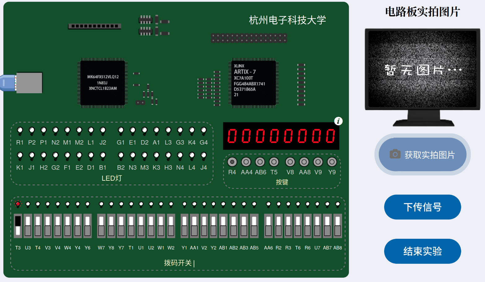

# barrelshifter32网上验证配置

## 网址

http://fpga.hdu.edu.cn/co/

## 输入Shift_Data

32位开关对应Shift_Data的32位，左侧为高位，右侧为低位

R4按钮按下后写入内部寄存器

## 输入SHIFT_OP和Shift_Num

SHIFT_OP={T3,U3,T4}

Shift_Num = {W7,Y8,Y7,T1,U1,U2,W1,W2} 

AA4按钮按下后写入内部寄存器

## 输入carry_flag

carry_flag = AB6

## 线上板机操作示范

烧录好bit流之后，首先输入Shift_Data，比如0x80000000，同时点亮R4:

点击下传

数码管会变成输入的数字，然后取消R4，点击下传：

这个是因为异步导致的多余操作，为了保证数据正确性。

然后进行SHIFT_OP和Shift_Num的下传，比如

SHIFT_OP=001

Shift_Num=00000001

同时点亮AA4，并下传。

可以看到移位后的结果，并且R1被点亮了，R1就是Shift_carry_flag。

到这里就完成了基本的测试，如果需要设置carry_flag，也可以通过AB6来设置。这里不进行赘述。使用完后，可以使用T5来进行清零操作：

